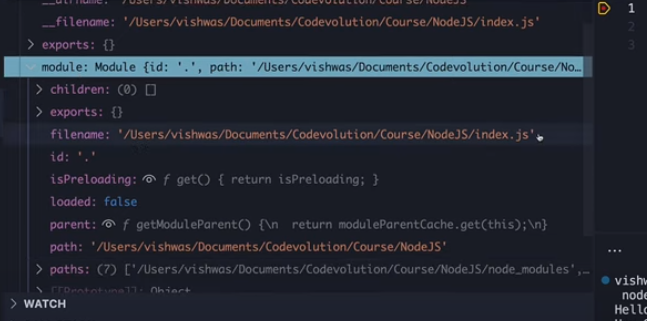

# Module Wrapper

- Every module in node.js gets wrapped in an IIFE function before being loaded
- IIFE helps keep top level variables scoped to the module rather than the the global scope
- The IIFE that wraps every module contains 5 parameters - exports, require, module, **filename, and **dirname which are pretty important for the functioning of a module

Let's see an example of module wrapper in Node.js.

```js
(function (message) {
  const superHeroName = "Batman";
  console.log(message, superHeroName);
})("Hello");
(function () {
  const superHeroName = "Superman";
  console.log(message, superHeroName);
})("Hey");
```

Output:

```js
Hello Batman;
Hey Superman;
```

This is how specify parameters and pass arguments to an immediate invoked function expression.

There are five in tota export require module

```js
(function (exports, require, module, __filename, __dirname) {
  // Module code
})();
```

By wrapping each module code in this iife with five parameters , provides few Global looking variables that are actually specific to the module.

```js
require("./Batman");
require("./Superman");
```

This is how we get access to require and module.exports from the iife.
They are not magical global variables . They are injected during execution by node.js .

### Now what do these parameters represent?

- exports
- require
- module
- \_\_filename
- \_\_dirname


You can see a set of local variable in the debug panel.
We have same five parameters along with `this` keyword which is available in the every function.

1. `__dirname` - First we have double underscore their name which is the directory or folder name of the current moudle. you can see the string represents the path to the current folder which is NodeJS.
2. `__filename` - same as Which is the file name path of the current module which is index.js.

3. `require` - which we already know about it is used to import a module by path.



if you expand it the file name point to index.js

4. `module` - which is a reference to the current module.
