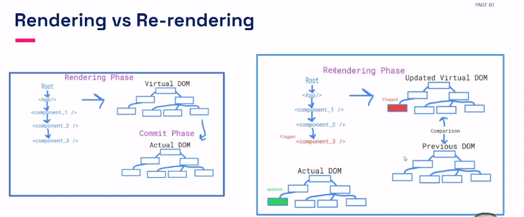
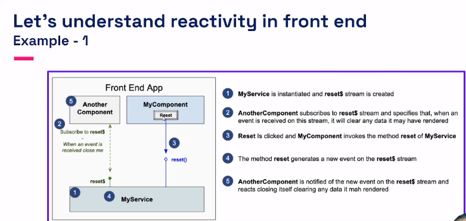
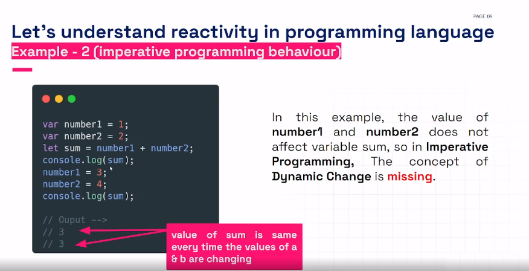
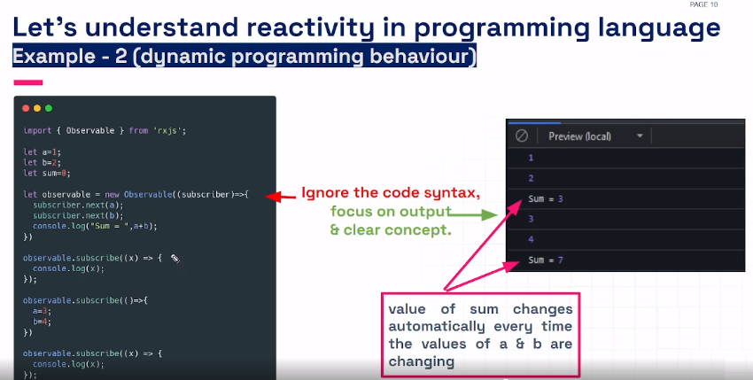
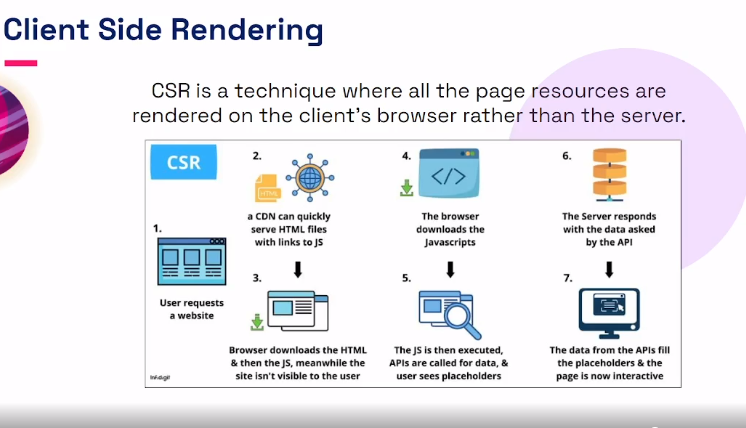
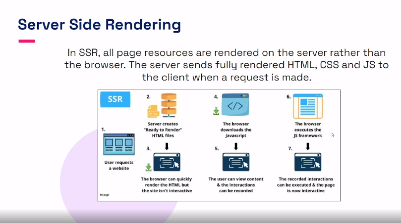

# Module 43.5 - Simple React Bonus

## 43_5-1 React virtual dom , diff algorithm

### If Document object model is so cool , then why go with virtual dom

_Consider a situation_

- Decorate the room with 100 ballons
- Now can you replace each of these with red colored ballons?
- A new condition - change ballon no 90 with a blue colored ballon, now you remove all ballons and bring 99 red vallins and 1 blue ballon and paint accordingly.
- Another condition - change balloon no 80 to green . you remove all the ballons. go market bring 98 red, 1 blue, 1 green and decorate the accordingly.

WoW , will you work this way? no, right? but you bocument object module does. so how to make dom intelligent? Now , Virtual DOM comes to rescue us.

### What is virtual dom ?

- lightweight copy of a dom object
- Has properties the same as real dom object
- Make changes in the dom with the help of the diff alogithm
- It's like: instead of moving actual rooms in a house, you edit the blueprint.

### How does virtual dom work?

- Change of state
- diffing
- re-render virtual dom
- DOM changes

### Virtual DOM vs Real DOM

| Virtual DOM                                             | Real DOM                                                         |
| :------------------------------------------------------ | :--------------------------------------------------------------- |
| DOM manipulation is very easy                           | DOM manipulation is very expensive                               |
| No memory wastage                                       | There is too much memory wastage                                 |
| It updates faster                                       | It updates slower                                                |
| It can't update HTML directly                           | It can update HTML directly                                      |
| Update the JSX it the element update                    | Creates a new DOM if the element updates                         |
| It can produce about 200,000 virtual dom nodes / second | It allows us to directly target any specific node (HTML element) |
| It is only a virtual representation of th dom           | It represents the UI of your application                         |

## 43_5-2 Client side rendering and server side rendering

### Know About render and reactivity

### What is Render in react?

- Render technically means to provide service.
- In react, render is a method that tell react what to display
- React schedules a render every time the state of a component changes.

### How does rendering happen?

```jsx
import React from "react";
import ReactDOM from "react-dom";

const App = () => <div>hello world</div>;

ReactDOM.render(<App />, document.getElementById("root"));
```

The render function requires two parameters:

- What is to be displayed
- Where to be displayed



### Reactivity

### Reaning of reactivity

The meaning of reactivity is the quality or state of being reactive.

In chemistry, Reactivity is a measuer of how easily an element will combine with other elements to form compounds (a new element)

### What is reactivity / reactive programming?

- Reactivity is an advanced overwhelming patadigm / model.
- Reactive Programing allows us to set cynamic behavior only at declaration time.
- Reactivite Programing is different from Imperative programing because as the name suggests, it reacts when something in our application is occurring or done.
- It relies on Asynchronous nature that happens in time.
- It stays responsive in the both case of failure and success.
- In the reactive world, we can not wait on something that will happen to the program. We have to continue the execution, and if something happens, we need to react to it. That is what the async pattern is.

### Is React Reactive?

React is not react. With a combination of RxJx, React becomes reactive.

RxJS (Reactive Extensions for JavaScript) is a library for reactive programming using observable that makes it easier to compose asynchronous or callback based code.

_Is RxJS the same as react ?_

- React is a javascript library for building user interfaces, RxJS is a javascript library for reactive programming.
- Both these libraries are not comparable to each other since it serves different purposes.
- Both these can be used together to create better single page applications



_Let's understand reactivity in programing language_

In general Programming paradigm, if sum = number1 + number2 at the time of declaration then sum will contain the result of addition of number1 and number2 at that moment of time.

However if after that statement, we change the value of number1 and number2 then value of sum will no get changed.




## Know about Server Side Rendering and Client Side Rendering





### SSR? CSR? When to use what?

_use SSR_

- if SEO is your priority, typically when you are building a blog site and you want everyone who searching on google go to your website, then SSR is your choice.
- if your website needs a faster initial loading.
- if the content of your wibsite doesnot need much user interction.

_use CSR_

- When SEO is not an issue, use CSR.
- If your site has rich interactions.
- if you are building a web application.
